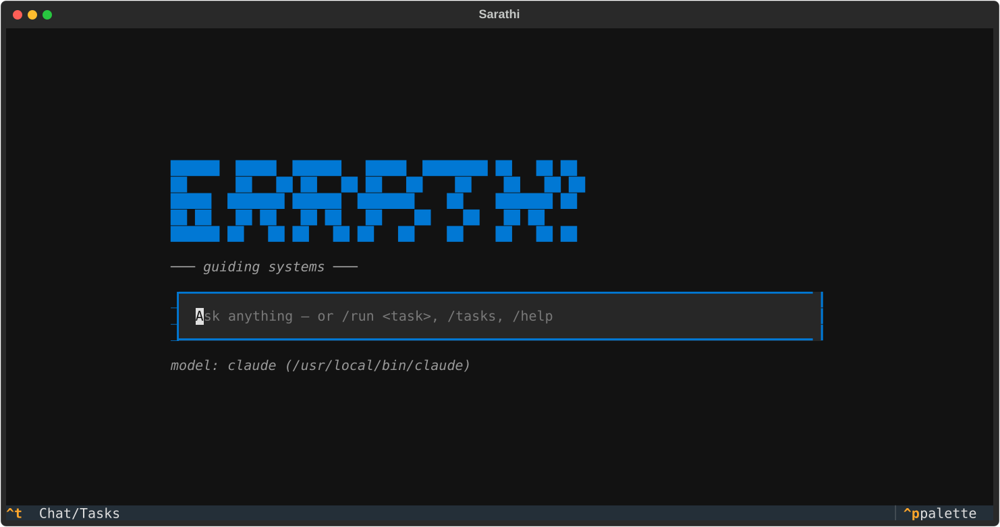
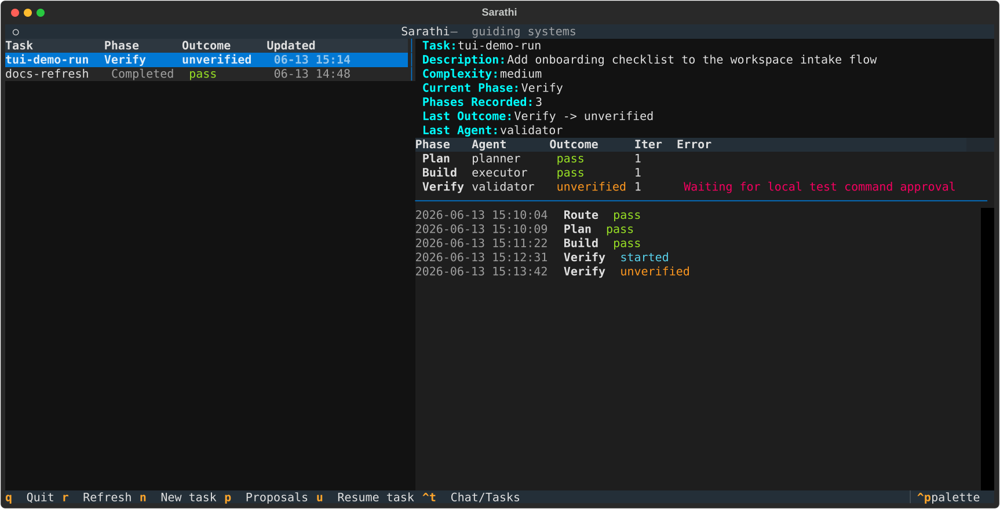

# Sarathi

Sarathi is a **Harness Engine** for AI-assisted software delivery — a policy-backed framework that certifies context, pre-declares permissions, and measures outcomes before and after every model call.
It gives teams a consistent, auditable lifecycle for planning, building, verifying, reviewing, and learning, with a self-improvement loop that evolves policy from measured execution data.

## What You Get

- A local CLI (`sarathi`) to initialize, validate, and run workflows
- A policy-pack model to keep behavior explicit and auditable
- A phase-based engine that can scale from simple tasks to complex work
- A portable agent skill pack (in `skill/SKILL.md`) for Claude Code, Codex, Copilot, and OpenCode

## Install

Pick whichever fits your setup. Sarathi targets Python 3.10+.

**One-line installer (recommended).** Creates an isolated venv and installs the CLI plus the `sarathi-desktop` cockpit:

```bash
curl -fsSL https://raw.githubusercontent.com/kulkarni2u/Sarathi/main/scripts/install.sh | bash
```

The installer puts everything under `$SARATHI_HOME` (default `~/.sarathi`, override by exporting `SARATHI_HOME` first) and prints how to add `~/.sarathi/venv/bin` to your `PATH`. Pass `--dry-run` (or set `SARATHI_DRY_RUN=1`) to preview the plan without changing anything.

**pip from GitHub.** Into any environment you manage yourself:

```bash
pip install "git+https://github.com/kulkarni2u/Sarathi.git"
```

**Homebrew.** Sarathi has no tagged release yet, so install from HEAD via a tap that carries `Formula/sarathi.rb`:

```bash
brew install --HEAD <your-tap>/sarathi
```

(The `--HEAD` flag is required until a versioned release is published.)

**Launch the desktop cockpit** once installed:

```bash
sarathi-desktop
```

## Quick Start

```bash
git clone https://github.com/kulkarni2u/Sarathi.git
cd Sarathi

python3 -m venv .venv
source .venv/bin/activate
python3 -m pip install -e .

sarathi --help
sarathi validate policy-pack/EXAMPLE
sarathi run "Fix null pointer in user service" --policy-pack policy-pack/EXAMPLE --dry-run
```

Install from any checkout or published wheel (declared dependencies such as PyYAML install automatically):

```bash
python3 -m pip install /path/to/Sarathi
# or from a clone:
python3 -m pip install -e .
```

## Terminal UI

A Textual-based, chat-first terminal UI for talking to an agent, watching runs live, browsing task history, and reviewing policy proposals without leaving the terminal:

```bash
python3 -m pip install -e ".[tui]"
sarathi tui                 # open the chat prompt
sarathi tui --task <id>     # open directly in the task panel, with a task pre-selected
sarathi tui --workspace <path>  # operate on a specific folder/repo
```





`sarathi tui` opens a centered chat prompt (OpenCode-style). Your first message docks the conversation to the bottom of the screen. Chat is sent to the first agent CLI found on PATH — `claude` (with true session continuity via `--resume`), then `opencode`, then `codex` — falling back to a help message if none is installed; `claude` replies stream in as they're generated, and `Esc` cancels a reply that's still in progress. Slash commands: `/run <task>` launches a task through the policy-backed lifecycle (including recent chat context automatically), `/cancel` stops the running task after the current phase (the partial run stays resumable), `/cd [path]` shows or switches the active folder/repo (re-rooting task storage, chat, and policy-pack discovery there, and starting a fresh agent session), `/init [path]` creates a policy pack for the workspace (the in-TUI equivalent of `sarathi init`), `/model [name]` shows or switches the agent CLI used for chat, `/context <task_id>` attaches a task's status to the conversation (truncated if large), `/clear` forgets the conversation and starts fresh, `/tasks` switches to the task panel, `/help` shows this help, and `/quit` exits. `Ctrl+T` toggles between the chat view and the task panel at any time.

- The **tasks** pane lists persisted tasks from `.sarathi/tasks` with their current phase and last outcome, refreshed every 2 seconds — so it can monitor runs started from the CLI, MCP server, or service.
- The **detail** pane shows the same supervision snapshot as `sarathi status` (usage, budget, task graph, escalations), per-phase results, and a live tail of the phase transition log.
- In the task panel, press `n` to launch a new task (description in, complexity auto-detected, runs through the full lifecycle in the background while the panel live-monitors it), `i` to create a policy pack for the workspace (the in-TUI equivalent of `sarathi init`), `u` to resume the selected task, `c` to cancel the running task after the current phase (it stays resumable), `p` to review pending policy proposals and accept (`a`) or reject (`x`) them into the discovered policy pack, `r` to force a refresh, and `q` to quit.

Cancellation and the task timeout are cooperative: a `/run` task checks for a cancel request (and a wall-clock cap, 30 minutes by default) between lifecycle phases, so it stops cleanly at the next phase boundary and the partial run can be resumed (`u` / `sarathi resume`) rather than being lost. A phase that hangs mid-call is bounded separately by the provider CLI's own subprocess timeout.

**Recommended terminal setup.** The TUI renders in whatever monospace font your terminal emulator is configured with; for the best look, use a free (OFL-licensed) ligature font such as Victor Mono (cursive italics), JetBrains Mono, Fira Code, or Cascadia Code. Enable ligatures where needed — iTerm2 ("Use ligatures"), VS Code (`"terminal.integrated.fontLigatures": true`), and Kitty/Ghostty/Windows Terminal support them out of the box, while Alacritty and macOS Terminal.app do not render ligatures. Sarathi's chat view uses italics for system messages and accents, which render as cursive in Victor Mono or Cascadia Code.

## MCP Server

Expose Sarathi as an MCP stdio server so MCP clients (Claude Code, Codex, etc.) can run tasks, check status, resume, browse history, and manage policy proposals natively:

```bash
python3 -m pip install -e ".[mcp]"
sarathi-mcp
```

Register it with Claude Code:

```bash
claude mcp add sarathi -- sarathi-mcp
```

Tools exposed: `run_task`, `task_status`, `resume_task`, `list_tasks`, `task_log`, `list_proposals`, `accept_proposal`, `reject_proposal`, `validate_policy_pack`.

### Optional: run real tests during Verify

By default Verify does not execute shell commands and reports the phase as `unverified` — it never fabricates pass/fail signals. To execute the `test.command` from `commands.md` and get real, measured results:

```bash
export SARATHI_EXEC_COMMANDS=1
export SARATHI_WORKDIR=/path/to/repo   # optional; defaults to cwd
export SARATHI_COMMAND_TIMEOUT=600     # optional; seconds
sarathi run "…" --policy-pack ./policy-pack
```

To run those commands inside a local container sandbox, choose a Docker-compatible
runtime. Docker is the default when sandboxing is enabled; Podman is also
supported. If the executable is not on `PATH`, set `SARATHI_SANDBOX_RUNTIME` to
the machine-local binary path instead of hardcoding it in policy or source.

```bash
export SARATHI_SANDBOX=docker

# Or:
export SARATHI_SANDBOX=podman

# Optional, only when the runtime binary is not on PATH:
export SARATHI_SANDBOX_RUNTIME=/path/to/docker-or-podman
```

### Optional: live provider smoke tests

`tests/live/` exercises the real provider CLIs (e.g. `claude -p --output-format json`)
end to end — it is opt-in and skipped by default since it makes real, billed
API calls (a couple of dollars worth at most per run). To run it:

```bash
SARATHI_LIVE_TESTS=1 python3 -m pytest tests/live -q
```

Each provider's tests additionally skip if that provider's CLI is not on
`PATH`. The suite validates Sarathi's side of the integration — envelope
parsing, reported token usage capture, cost/session-id artifacts, workspace
delta measurement, and `--resume` session continuity — not whether the
agent obeys every instruction.

### Task history

```bash
sarathi list
sarathi log <task_id>
```

### Task status and resumability

```bash
sarathi status <task_id>        # Show task status, graph progress, escalation summary
sarathi resume <task_id>        # Resume a paused or failed task
sarathi reuse                   # Show live workflow templates, saved views, and learned playbooks
```

### Policy proposals

```bash
sarathi proposals                                 # Show policy proposals from persisted learnings
sarathi proposals --accept <proposal_id>          # Append an accepted proposal to its policy file
sarathi proposals --reject <proposal_id> --reason "Already covered"
sarathi proposals --policy-pack ./policy-pack --accept <proposal_id>
```

### Agent roles

```bash
sarathi agents               # Show Sanskrit-inspired agent role names and phase mapping
```

### Workspace Repository Bootstrap

When a repository is attached to a workspace through the local service:

- preview reports repo inspection details plus which Sarathi bootstrap artifacts are present or missing,
- attach remains approval-gated,
- initialize remains approval-gated and only creates missing bootstrap files,
- existing repo-owned docs and policy files are preserved rather than overwritten.

The current bootstrap contract covers:

- `SARATHI.md`
- `wiki/README.md`, `wiki/architecture.md`, `wiki/development.md`
- `coding-standards.md`
- `guidelines.md`
- `learnings.md`
- the full canonical `policy-pack/` set generated from Sarathi init templates

Task-graph snapshots exposed by the local service now also include orchestration semantics such as:

- `ready_nodes`
- `active_nodes`
- `blocked_nodes`
- `waiting_human_nodes`
- `fan_out_ready_nodes`
- `fan_in_nodes`
- `coordination_state`

Workspace policy packs can also opt into cascade scheduling for the service task runtime:

```yaml
graph_execution:
  auto_schedule_ready_nodes: true
```

When enabled, approving the Task graph can immediately start all ready root units, and later blocker completion can auto-start newly ready downstream units without another manual schedule action.

### Python API (agents, scripts)

After `pip install -e .`, import the engine from the `src` package (matches setuptools layout in `pyproject.toml`):

```python
from src.engine import Engine, TaskContext, Complexity, Phase
```

Runtime helpers also expose the Sanskrit-inspired role registry used for
Sarathi-created workers:

```python
from src.runtime import get_agent_role, list_agent_roles

planner = get_agent_role("planner")  # Disha
roles = list_agent_roles()
```

### Provider and scheduler hooks

`model-routing.md` can declare deterministic or command-backed providers:

```yaml
provider: local
providers:
  local: {}
  tool:
    type: command
    command: ["python", "provider.py"]
```

The runtime also exposes `TaskScheduler` for phase-independent graph work-unit scheduling.

Workspace provider settings feed service-side routing:

- `local` — deterministic built-in (default for tests and dry-runs)
- `claude` — native `claude -p {prompt} --output-format json` bridge; unwraps the Claude Code JSON envelope automatically
- `codex` — native `codex exec --skip-git-repo-check -o {file} {prompt}` bridge
- `copilot` — `gh copilot -- -p {prompt}` bridge (requires `gh auth login`)
- `opencode` — HTTP bridge via `opencode serve`; starts a local server, creates a session, and reads the SSE stream for the response
- Any provider can also point at a custom executable that reads Sarathi JSON from stdin and returns a normalized JSON result on stdout

Provider tool permissions are declared in `policy-pack/permissions.md` as
mode-specific grants: `read_only`, `read_write`, and `full`. `sarathi init`
writes the initial native config files (`.claude/settings.json`,
`~/.codex/config.yaml`, `opencode.json`), and provider dispatch refreshes those
configs from the current harness permission mode before invoking
Claude/Codex/OpenCode. No runtime permission-bypass flags are used.

To wire real CLI providers in a policy pack:

```yaml
# policy-pack/model-routing.md
provider: claude
providers:
  claude:
    type: command
    command: "python3 -m src.runtime.providers.cli_bridge --provider claude --path /path/to/claude --workspace-root ."
    timeout_seconds: 300
  copilot:
    type: command
    command: "python3 -m src.runtime.providers.cli_bridge --provider copilot --path /path/to/gh --workspace-root ."
    timeout_seconds: 300
```

Set `SARATHI_DISPATCH_TIMEOUT=300` (or higher) when running real provider dispatch to avoid the thread-level timeout firing before the subprocess completes.

Native Claude/Copilot runs execute from the workspace root and persist bridge metadata such as CLI family, invocation kind, and workspace root inside dispatch evidence.

Recovery loops carry provider context forward. When verify/review retries are triggered, Sarathi classifies failures such as `auth`, `provider_offline`, and `native_cli_failure` and passes that context into recovery actions and retry guidance.

Provider-backed dispatch evidence can also carry structured `review_trace` findings. Sarathi persists those with provider/file/line metadata and surfaces provider trace counts in review summaries.

Dispatch evidence can now also carry:

- `diff_trace` hunks with provider/file/line/header/excerpt detail
- `spec_trace` references that map acceptance-criterion IDs and requirement text to exact code regions

When that richer evidence is present, approved review runs persist those diff/spec references directly and AC coverage maps to explicit evidence references rather than treating any evidence as blanket coverage for every criterion.

If structured provider `spec_trace` data is partial or explicitly failing, Sarathi now treats that as review-blocking spec drift: the review is rejected and the unit is requeued instead of being auto-approved.

Provider `diff_trace` hunks can also carry reviewer-grade metadata such as `category`, `confidence`, and `suggestion`. Sarathi persists those fields on review findings and synthesizes review-level diff summaries including blocker counts, average confidence, risk categories, and patch-region highlights.

Those diff summaries now also cluster related hunks into grouped patch regions and emit a `review_confidence_verdict` with explicit reasons, so downstream review surfaces can show both the risky regions and the overall trust level of the provider-backed patch analysis.

### Multi-worker execution

Scale subtask dispatch across N processes (or machines sharing the DB and workspace):

```bash
# Start the service as usual, then in N separate terminals:
python -m src.service.worker --db .sarathi/sarathi.db
```

Each worker polls for subtasks that `_schedule_ready_subtasks` made ready
(`in_progress` with no claim), atomically claims one (a single guarded SQLite
`UPDATE`, so claims never double up), dispatches it through the same provider
machinery the HTTP API uses, and records the result.

A worker that crashes mid-dispatch leaves its claim's heartbeat stale; the
next poll by any worker requeues that subtask (default lease: 600s, `--lease`
to tune). Use `--once` for a single pass (e.g. CI) and `--worker-id` to set
a stable identity.

## Lifecycle Architecture

### Static outer spine

Every task walks the same 12-phase chain in order:

```
ROUTE → BRAINSTORM → PLANNING_ADVISOR → PLAN → BUILD → VERIFY
      → REVIEW → TASK_TRACKING → RISK_CHECK → ELEGANCE → PHASE_LOG → LEARN
```

The sequence is fixed. The only static variation is **complexity-based skipping** — PLANNING_ADVISOR is dropped for LOW and MEDIUM tasks. Two runtime escape hatches exist: a phase can emit `next_phase_override` to redirect the chain, or `pause_execution` to suspend for human approval. If the NCP Trust Gate blocks the task after ROUTE, the engine jumps straight to LEARN.

### Dynamic inner graph

The PLAN phase generates a **task graph** of typed nodes; BUILD executes it. Six `NodeType` patterns drive how nodes are wired at plan time:

| Pattern | `NodeType` | What happens |
|---------|-----------|--------------|
| Classify-and-Act | `CLASSIFY` | Routes to typed downstream branches at runtime |
| Fanout-and-Synthesize | `FANOUT` / `SYNTHESIZE` | Spawns N parallel child nodes, merges results |
| Adversarial Verification | `JUDGE` | Independent verifier nodes vote on output quality |
| Generate-and-Filter | `EXECUTE` + `JUDGE` | N generators scored and filtered |
| Tournament | `JUDGE` | Best-of-N selection with judge rounds |
| Loop-Until-Done | `LOOP_GATE` | Retries until a stop condition is met |

Enabled patterns and their parameters are declared in `policy-pack/workflow-patterns.md`:

```yaml
patterns:
  classify_and_act:          { enabled: true }
  fanout_and_synthesize:     { enabled: true, max_branches: 3 }
  adversarial_verification:  { enabled: true, verifier_count: 2, pass_threshold: 2 }
  loop_until_done:           { enabled: true, max_iterations: 5 }
```

**In short:** the phase *order* is static and policy-auditable; the *work inside each phase* is dynamically composed from typed graph nodes at plan time.

---

## Harness Engine

Sarathi is a Harness Engine, not just a workflow runner. At ROUTE time it compiles a `HarnessConfig` — a serializable, diffable, versionable artifact that pre-declares context scope, permission surface, agent assignment, and quality targets *before* any model call is made.

### TaskClass taxonomy

The ROUTE phase classifies every task into one of 12 classes that drive all assembly defaults:

| Family | Classes |
|--------|---------|
| Read-only | `query`, `analysis` |
| Code changes | `codegen/greenfield`, `codegen/refactor`, `codegen/patch` |
| Mutations | `mutation/config`, `mutation/infra`, `mutation/data` |
| Orchestration | `orchestration/pipeline`, `orchestration/delegation` |
| Self-improvement | `evolution/harness`, `evolution/context` |

```python
from src.task_class import TaskClass, classify_task_class

tc = classify_task_class("deploy infra with terraform")
# → TaskClass.MUTATION_INFRA
```

### HarnessConfig

A compiled harness carries the full execution contract for one task:

```python
from src.harness import HarnessConfig
from src.task_class import TaskClass

hc = HarnessConfig.from_task_class(TaskClass.CODEGEN_PATCH, task_id="task-001")
print(hc.context_scope)           # "targeted"
print(hc.permission_scope)        # "repo_write_scoped"
print(hc.primary_agent.agent_id)  # "local"
print(hc.quality_signals)         # [QualitySignalDef("test_pass_rate"), ...]
print(hc.assembly_mode)           # "STANDARD"

# Serialise / restore / diff
json_str = hc.to_json()
restored = HarnessConfig.from_json(json_str)
delta = hc.diff(restored)
```

**Assembly modes** — the engine caches harness configs by TaskClass to avoid redundant assembly:

| Mode | When | Behaviour |
|------|------|-----------|
| `STANDARD` | First task of a given class | Full build; stored in cache |
| `FAST` | Cache hit for same class | Skeleton reused; only identity fields (`harness_id`, `task_id`, `assembled_at`, `trace_id`) are refreshed |
| `DEEP` | Any `mutation/*` or `evolution/*` | Always rebuilds — irreversible side-effects demand a fresh context assessment |

### Agent selection

`agent_preference` in each TaskClass's defaults resolves to a concrete provider at assembly time:

| Preference | Resolved agent | Typical classes |
|-----------|---------------|-----------------|
| `fastest` | `local` | `query` |
| `balanced` | `local` | `analysis`, `codegen/patch`, `codegen/refactor` |
| `highest_capability` | `claude` | `codegen/greenfield`, `mutation/*`, `evolution/*` |
| `sarathi_native` | `local` | `orchestration/*` |

After ROUTE, the engine's `_HarnessAwareDispatcher` injects the resolved provider into every subsequent dispatch request (when no explicit `constraints["provider"]` is already set). `balanced`/`fastest` → `local` means "no strong preference — let provider-config routing decide."

```python
from src.harness import resolve_agent_binding

binding = resolve_agent_binding("highest_capability")
# → AgentBinding(agent_id="claude")
```

### PermissionScope

Every TaskClass carries a pre-declared permission surface:

```python
from src.permissions import build_permission_scope
from src.task_class import TaskClass

scope = build_permission_scope(TaskClass.MUTATION_INFRA)
print(scope.requires_human_approval)  # True
print(scope.side_effect_class)        # "IRREVERSIBLE"
```

Mutation and evolution classes auto-require human approval. `IRREVERSIBLE` operations auto-require confirmation before dispatch.

### TrustGate (NCP mode)

When NCP is enabled, Sarathi runs a formal context handshake after ROUTE. The gate returns PASS / WARN / BLOCK and the engine applies an arbitration matrix:

| Gate result | Task class | Engine action |
|-------------|-----------|---------------|
| `PASS` | any | Execute normally |
| `WARN` | `query` / `analysis` | Execute flagged (`stale_keys` recorded in harness) |
| `WARN` | `mutation/*` / `evolution/*` | Block until NCP refreshes stale context |
| `BLOCK` | any | Abort and escalate directly to LEARN |

### HarnessOutcome and quality signals

After every task, `measure_outcome()` extracts real quality signals from phase artifacts — no mock values:

```python
from src.harness import measure_outcome

outcome = measure_outcome(task, harness_config)
print(outcome.quality_signals)    # {"test_pass_rate": 0.95, "blast_radius": 0.05, ...}
print(outcome.token_cost_actual)  # 1840
print(outcome.latency_ms)         # 3200
print(outcome.agent_used)         # "claude"
```

Signal sources:

| Signal | Extracted from |
|--------|---------------|
| `test_pass_rate` | VERIFY `command_succeeded`; falls back to `coverage / 100` |
| `blast_radius` | `1.0 − review_score` from REVIEW `review_verdict` |
| `accuracy` / `relevance` | REVIEW `review_verdict.score` |
| `token_cost` | Sum of `dispatch_usage.total_tokens` across all phases |
| `latency` | `assembled_at → now` in milliseconds |
| `rollback_triggered` | Any phase with `recovery_actions` or `rollback_triggered` artifact |

The LEARN phase feeds `HarnessOutcome` into the Evolver, which compares signals against per-TaskClass baselines and generates `PolicyProposal` records when a signal deviates by more than 10%.

---

## Common Commands

```bash
# Initialize a policy pack in the current directory
sarathi init .

# Validate a policy pack
sarathi validate ./policy-pack
sarathi validate ./policy-pack --verbose

# Run a task
sarathi run "Add OAuth2 authentication" --policy-pack ./policy-pack
```

## NCP Integration

Sarathi is moving to an **NCP-first context path**. Native adapters still work, but a workspace initialized with NCP becomes the preferred/default runtime for context assembly, memory, artifact storage, whispers, and token/cost tracking.

NCP (Neural Context Protocol) runs as a local sidecar. In direct mode, Sarathi talks to it through the project-local `.ncp/run.py` bridge created by `sarathi init --ncp`.

- **Persistent cross-session memory** — agents recall findings from prior runs
- **Cross-agent whispers** — fanout/classify branches receive context from their parent
- **Pattern-aware context** — SYNTHESIZE and JUDGE nodes fetch sibling outputs automatically
- **Pipeline cost tracking** — per-node token spend logged back to NCP

### Setup

NCP is available on PyPI — **[kulkarni2u/neural-context-protocol](https://github.com/kulkarni2u/neural-context-protocol)**

```bash
# Install NCP alongside Sarathi (recommended)
pip install sarathi[ncp]

# Or install NCP separately
pip install neural-context-protocol

# Bootstrap NCP into your project:
# - .ncp/config.toml
# - .ncp/run.py direct bridge
# - .ncp/WELCOME.md
sarathi init --ncp

# Run normally; Sarathi auto-detects the NCP bridge
sarathi run "task description"

# Force NCP and fail if it is unavailable
sarathi run --ncp "task description"

# Opt out for a run and use native adapters
sarathi run --no-ncp "task description"
```

Sarathi auto-detects NCP only when `.ncp/config.toml` and an executable `.ncp/run.py` are present and the bridge answers `status`. A config-only `.ncp/` directory is treated as not ready, so Sarathi uses native adapters instead of announcing a false NCP runtime.

### When you need NCP

| Scenario | Without NCP | With NCP |
|----------|-------------|----------|
| Single-session tasks | Full functionality | Same |
| Dynamic workflow patterns (FANOUT, CLASSIFY, LOOP) | No cross-node context, no whispers | Branch agents receive parent context |
| Multi-session tasks | Each session starts cold | Prior findings persist across sessions |
| Cost reporting | Local estimates only | Per-node actuals logged |

### Transport modes

- `--ncp-mode direct` (default) — Sarathi forks `.ncp/run.py` as a subprocess
- `--ncp-mode mcp` — Sarathi sends JSON-RPC to an NCP server at `--ncp-endpoint`
- `--ncp-router` — enable whisper-based cross-phase signaling

NCP can be toggled via `--ncp` / `--no-ncp` flags or set as the default in `model-routing.md`.

## Repository Layout

```text
Sarathi/
├── src/                 # CLI + engine implementation
├── tests/               # Test suite
├── policy-pack/         # EXAMPLE and TEMPLATE policy packs
├── docs/                # Supporting documentation
├── DESIGN.md            # Design notes
└── README.md
```

## Companion Skill Pack

This repo contains both the CLI framework and the portable skill pack.

- `skill/SKILL.md` — attach to any agent host (Claude Code, Codex CLI, Copilot, OpenCode)
- `skill/policy-pack/` — EXAMPLE and TEMPLATE policy packs for bootstrapping new projects
- `skill/reference/` — policy reference docs the skill reads at runtime

Source checkouts expose the skill pack directly at `skill/`. Published source and wheel builds now also carry the companion files so release artifacts stay aligned with the repo layout.

For GitHub Copilot agent-mode integration, see the agent entry example in `skill/SKILL.md`.

## Contributing

See [CONTRIBUTING.md](./CONTRIBUTING.md).

## License

MIT. See [LICENSE](./LICENSE).
