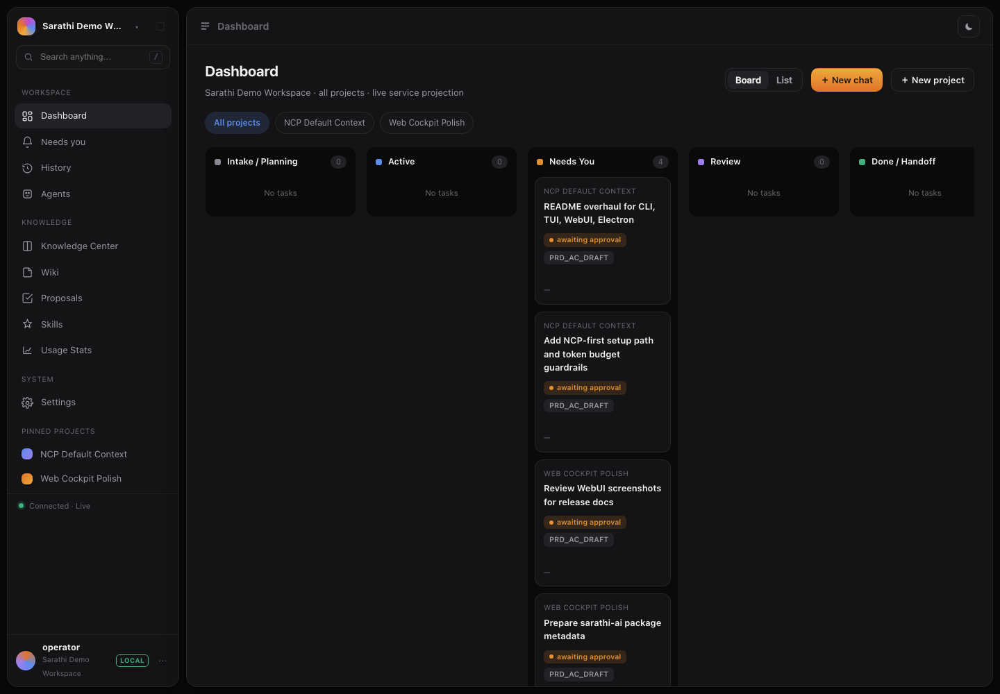
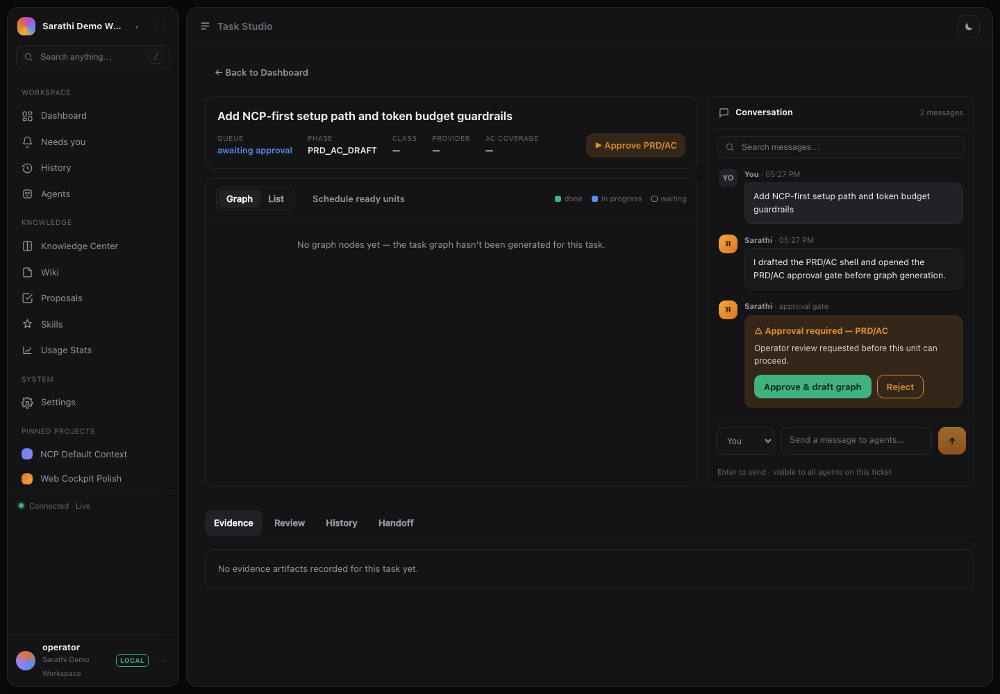
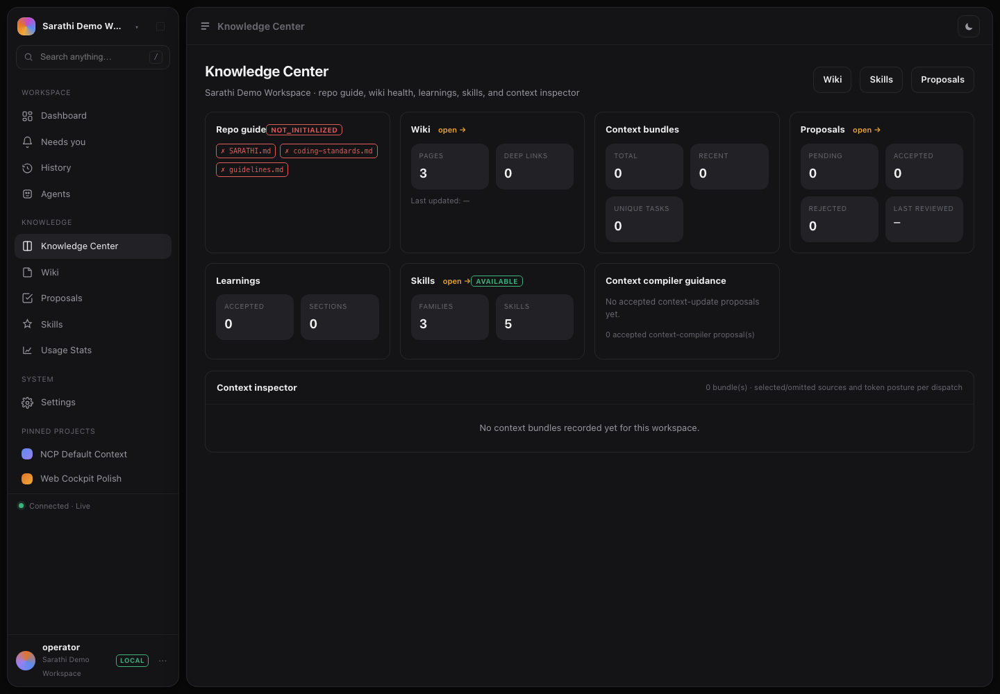

# Sarathi

<p align="center">
  
</p>

Sarathi is a local-first AI delivery cockpit for software teams. It gives AI
agents a governed lifecycle for planning, building, verifying, reviewing, and
learning, then exposes that same work through the CLI, terminal UI, web cockpit,
Electron desktop shell, MCP server, and Python API.

The core idea is simple: one local Sarathi service owns state, policy, evidence,
and approvals. Every surface is a client over that same source of truth.

```text
                 Local Sarathi service
              HTTP API + SQLite + policy runtime
                            |
        +-------------------+-------------------+
        |                   |                   |
      CLI/TUI           Web cockpit       Electron shell
    sarathi ...          web/ SPA           desktop/
        |
      MCP server + Python API integrations
```

## Why Sarathi Exists

AI coding tools are powerful, but most runs are still loose conversations:
unclear context, unclear permissions, unclear evidence, unclear handoff.
Sarathi wraps those runs in a harness:

- policy packs declare context, commands, providers, review rules, escalation,
  permissions, and workflow patterns before execution starts
- tasks move through a fixed lifecycle from route to learn
- complex work can fan out into task graphs with approvals and evidence
- provider calls record usage, artifacts, diffs, review traces, and handoffs
- policy proposals are generated from measured execution data, not vibes

Sarathi works without cloud services. NCP ships as the local context-management
path, and optional MCP clients layer on top of the local runtime.

## Surfaces

| Surface | Command or path | Use it for |
| --- | --- | --- |
| CLI | `sarathi` | Init projects, validate policy, run tasks, inspect status, resume, review proposals, list recipes, attach/fork sessions |
| TUI | `sarathi tui` or `sarathi chat` | Chat-first terminal workflow with live task dashboard, phase logs, approvals, and proposal review |
| Web cockpit | `web/` served by the local service or Vite | Dashboard, Needs You, Task Studio, History, Agents, Knowledge Center, Wiki, Proposals, Skills, Usage, Settings |
| Local desktop stack | `sarathi desktop` | Starts the Python service and Vite web UI together for development/local use |
| Electron shell | `desktop/` | Native wrapper that loads the service-hosted web cockpit and can build a macOS `.dmg` |
| MCP server | `sarathi-mcp` | Lets MCP clients run tasks, inspect status/logs/history, and manage policy proposals |
| Python API | `src.*` | Embed the engine, harness config, scheduler, roles, and runtime helpers in scripts or tests |

## Install

Sarathi targets Python 3.11+.

### One-line installer

The installer creates an isolated virtual environment under `$SARATHI_HOME`
(default `~/.sarathi`) and installs the CLI plus desktop launcher.

```bash
curl -fsSL https://raw.githubusercontent.com/kulkarni2u/Sarathi/main/scripts/install.sh | bash
```

Preview without changing anything:

```bash
curl -fsSL https://raw.githubusercontent.com/kulkarni2u/Sarathi/main/scripts/install.sh | bash -s -- --dry-run
```

### Install from GitHub

```bash
python3 -m pip install "git+https://github.com/kulkarni2u/Sarathi.git"
```

### Developer install

```bash
git clone https://github.com/kulkarni2u/Sarathi.git
cd Sarathi

python3 -m venv .venv
source .venv/bin/activate
python3 -m pip install -e ".[tui,mcp,dev]"
```

For a guided local setup after install:

```bash
sarathi setup
```

Useful extras:

| Extra | Installs |
| --- | --- |
| `tui` | Textual/Rich terminal UI dependencies |
| `mcp` | MCP server dependency |
| `dev` | Test and formatting tools |

## Quick Start

Initialize Sarathi in a project:

```bash
cd /path/to/your/repo
sarathi init .
sarathi validate ./policy-pack --verbose
```

Run a governed task:

```bash
sarathi run "Fix the failing checkout test" --policy-pack ./policy-pack
```

See the lifecycle without dispatching:

```bash
sarathi run "Add OAuth2 authentication" --policy-pack ./policy-pack --dry-run
```

Open the terminal cockpit:

```bash
sarathi tui
```

Start the local service plus WebUI dev stack:

```bash
cd /path/to/Sarathi
cd web && npm install
cd ..
sarathi desktop
```

Build and serve the web cockpit from the Python service:

```bash
cd web
npm install
npm run build
cd ..
python3 -m src.service --db ~/.sarathi/sarathi.db --port 8765
```

Then open `http://127.0.0.1:8765/`. The service injects the browser runtime
config through `/sarathi-runtime.js`, including the local bearer token.

## CLI

The CLI is the fastest way to bootstrap and inspect work.

```bash
sarathi setup                          # guided TUI/WebUI/NCP/Desktop setup
sarathi init .                         # create policy-pack and local repo wiki
sarathi init . --no-wiki               # skip generated .sarathi/wiki output
sarathi validate ./policy-pack         # validate required policy files
sarathi validate ./policy-pack -v      # include detailed validation results

sarathi run "Add search filters"       # auto-discover policy-pack when possible
sarathi run "Add search filters" --dry-run
sarathi run "Refactor auth" --complexity high
sarathi run "Compare providers" --recipe policy-pack/RECIPES/debate

sarathi status <task_id>
sarathi watch <task_id>
sarathi resume <task_id>
sarathi list
sarathi log <task_id>

sarathi proposals
sarathi proposals --accept <proposal_id> --policy-pack ./policy-pack
sarathi proposals --reject <proposal_id> --reason "Already covered"

sarathi reuse
sarathi agents
sarathi recipes
sarathi attach <share_token> --role observer
sarathi fork <session_id>

sarathi autoresearch register --hypothesis "..." --prediction "..." --tier MICRO \
  --method "..." --quality-gate "..."
sarathi autoresearch evidence <experiment_id> --summary "..." --metric key=value
sarathi autoresearch verdict <experiment_id> --verdict confirmed --summary "..."
sarathi autoresearch list
```

Running `sarathi` with no subcommand prints the local home screen, including
service discovery status when a Sarathi service is already running.

## Terminal UI

`sarathi tui` is a chat-first terminal interface backed by the same task state as
the CLI and service.

```bash
python3 -m pip install -e ".[tui]"
sarathi tui
sarathi tui --workspace /path/to/repo
sarathi tui --task <task_id>
```


What it supports:

- centered chat prompt that docks into an ongoing conversation
- provider chat via `claude`, `opencode`, or `codex` when those CLIs are on PATH
- `/run <task>` to launch a governed task with recent chat context
- `/cd [path]` to switch active workspace/repo
- `/init [path]` to create a policy pack from inside the TUI
- `/model [name]` to show or switch the agent CLI used for chat
- `/context <task_id>` to attach task status to the conversation
- `/tasks`, `/clear`, `/cancel`, `/help`, and `/quit`
- `Ctrl+T` to switch between chat and task dashboard

The task panel monitors `.sarathi/tasks`, phase transitions, graph state,
escalations, and proposal review. Cancellation is cooperative: tasks stop at the
next phase boundary and can be resumed later.

## Web Cockpit

The WebUI is a Vite/React cockpit under `web/`. It consumes the local service API
and uses the same projections as the other clients.

Top-level routes today:

- Dashboard
- Needs You
- History
- Agents
- Knowledge Center
- Wiki
- Proposals
- Skills
- Usage Stats
- Settings
- Manage Workspace
- Task Studio (`/task/:id`)

Screenshots from the local WebUI:







For WebUI development:

```bash
cd web
npm install
npm run dev
```

For the normal same-origin app path, build `web/dist` and run the Python service:

```bash
cd web
npm run build
cd ..
python3 -m src.service --db ~/.sarathi/sarathi.db --port 8765
```

API documentation is served by the same service:

```text
http://127.0.0.1:8765/docs
http://127.0.0.1:8765/openapi.json
```

## Desktop

There are two desktop-related pieces.

`sarathi desktop` starts the local Python service and the Vite WebUI together.
It writes a temporary runtime config script so the browser app knows the service
base URL and bearer token.

```bash
sarathi desktop

# Useful dev options:
sarathi desktop --service-port 0 --vite-port 0
sarathi desktop --service-only
sarathi desktop --ui-only --service-port 8765 --token <token>
sarathi desktop --print-config
```

The Electron shell lives in `desktop/`. It opens the service-hosted cockpit in a
native window and can package a macOS artifact.

```bash
cd web
npm install
npm run build

cd ../desktop
npm install
npm start
npm run dist:mac
```

The Electron packaging path currently expects Node.js 22.12+ and a host Python
3.11+ runtime with Sarathi importable. It does not bundle a standalone Python
runtime yet.

## Local Service

The service is the shared state layer for the CLI, TUI, WebUI, desktop shell, and
MCP integrations.

```bash
python3 -m src.service --db ~/.sarathi/sarathi.db --port 8765
```

It provides:

- HTTP JSON API under `/api/...`, with same-origin aliases for the WebUI client
- same-origin static hosting for `web/dist`
- `/sarathi-runtime.js` runtime config injection
- SSE event replay for live views
- SQLite-backed workspaces, projects, tasks, sessions, approvals, dispatches,
  evidence, reviews, handoffs, proposals, and usage stats
- service discovery in `~/.sarathi/service.json` with `0600` permissions

The local API is bearer-token protected. In the default single-user mode, the
shared service token is enough. Setting `SARATHI_AUTH_ENABLED=1` enables per-user
tokens while still allowing the service admin token.

## MCP Server

Expose Sarathi to MCP clients:

```bash
python3 -m pip install -e ".[mcp]"
sarathi-mcp
```

Register with Claude Code:

```bash
claude mcp add sarathi -- sarathi-mcp
```

The server exposes task execution, status, resume, history/log inspection,
policy validation, and proposal review tools.

## Policy Packs

`sarathi init .` creates or reconciles a project policy pack:

```text
policy-pack/
  commands.md
  complexity.md
  conventions.md
  escalation.md
  model-routing.md
  notifications.md
  permissions.md
  review.md
  skills.md
  task-tracking.md
  workflow-patterns.md
```

It also generates local bootstrap artifacts, including a deterministic
`.sarathi/wiki` repo map unless `--no-wiki` is passed. The generated wiki is
local and model-free.

Policy files control:

- what commands can run during verification
- how tasks are classified and escalated
- which providers are used
- provider-native permission config for Claude, Codex, and OpenCode
- review gates and handoff rules
- reusable workflow patterns such as fanout, judge, and loop gates

Provider permissions are declared in `policy-pack/permissions.md` as
`read_only`, `read_write`, and `full` grants. Sarathi writes native config files
for supported CLIs and refreshes them from the current permission mode before
dispatch. Runtime permission bypass flags are not used.

## Providers

Sarathi can run with the built-in local provider, native CLI providers, SDK
providers, or custom command-backed providers.

Common routing shape:

```yaml
# policy-pack/model-routing.md
provider: claude
providers:
  local: {}
  claude:
    type: command
    command: "python3 -m src.runtime.providers.cli_bridge --provider claude --path /path/to/claude --workspace-root ."
    timeout_seconds: 300
  codex:
    type: command
    command: "python3 -m src.runtime.providers.cli_bridge --provider codex --path /path/to/codex --workspace-root ."
    timeout_seconds: 300
  opencode:
    type: command
    command: "python3 -m src.runtime.providers.cli_bridge --provider opencode --path /path/to/opencode --workspace-root ."
    timeout_seconds: 300
```

Set a longer dispatch timeout for real provider calls when needed:

```bash
export SARATHI_DISPATCH_TIMEOUT=300
```

Provider dispatch evidence can include usage, session IDs, workspace deltas,
review traces, diff traces, spec traces, retry context, and recovery
classification. The review phase uses structured evidence when available instead
of treating a provider response as blanket proof.

## Slack Notifications

Sarathi can post to a Slack channel when a run needs attention: task
completed/failed, a phase paused for human input, budget exhausted, an
approval requested, or a review rejected. Notifications are best-effort — a
Slack outage never blocks a run — and secrets stay in the environment.

Fastest path (incoming webhook):

```bash
export SARATHI_SLACK_WEBHOOK_URL="https://hooks.slack.com/services/T000/B000/XXXX"
sarathi run "Fix the failing checkout test" --policy-pack ./policy-pack
```

Bot-token mode (one token, any channel the bot is invited to):

```bash
export SARATHI_SLACK_BOT_TOKEN="xoxb-..."
export SARATHI_SLACK_CHANNEL="#sarathi-runs"
```

Which events notify is policy: `policy-pack/notifications.md` declares the
event list for engine runs (CLI/TUI/MCP), with fnmatch patterns such as
`approval.*` or `phase.*`. The local service and work-queue worker fan out
their `lifecycle_events` stream using environment-only configuration
(`SARATHI_SLACK_EVENTS` narrows the event list, comma-separated). See
`policy-pack/EXAMPLE/notifications.md` for the full reference.

## Verification Commands

By default, Verify does not execute shell commands and reports the phase as
`unverified`. To run the `test.command` declared in `commands.md`:

```bash
export SARATHI_EXEC_COMMANDS=1
export SARATHI_WORKDIR=/path/to/repo
export SARATHI_COMMAND_TIMEOUT=600
sarathi run "Run the real test gate" --policy-pack ./policy-pack
```

To run commands inside a local container sandbox:

```bash
export SARATHI_SANDBOX=docker

# Or:
export SARATHI_SANDBOX=podman

# Optional when the binary is not on PATH:
export SARATHI_SANDBOX_RUNTIME=/path/to/docker-or-podman
```

## Lifecycle

Every standard task walks the same outer phase chain:

```text
ROUTE -> BRAINSTORM -> PLANNING_ADVISOR -> PLAN -> BUILD -> VERIFY
      -> REVIEW -> TASK_TRACKING -> RISK_CHECK -> ELEGANCE -> PHASE_LOG -> LEARN
```

The outer order is fixed and auditable. Low and medium tasks skip
`PLANNING_ADVISOR`. A phase can still pause for approval or redirect via an
explicit override.

Inside that outer lifecycle, PLAN can generate a task graph. BUILD and the
service scheduler can execute graph units with patterns declared in
`workflow-patterns.md`:

| Pattern | Purpose |
| --- | --- |
| `classify_and_act` | Route work to typed downstream branches |
| `fanout_and_synthesize` | Run multiple branches and merge results |
| `adversarial_verification` | Use independent verifier nodes |
| `generate_and_filter` | Generate multiple candidates, score, then keep the best |
| `loop_until_done` | Retry until a stop condition or max iteration limit |

Example:

```yaml
patterns:
  classify_and_act: { enabled: true }
  fanout_and_synthesize: { enabled: true, max_branches: 3 }
  adversarial_verification: { enabled: true, verifier_count: 2, pass_threshold: 2 }
  loop_until_done: { enabled: true, max_iterations: 5 }
```

The service can also auto-schedule ready graph nodes when policy allows it:

```yaml
graph_execution:
  auto_schedule_ready_nodes: true
```

## Harness Engine

Sarathi compiles a `HarnessConfig` during ROUTE. That artifact pre-declares:

- task class
- context scope
- permission scope
- primary agent binding
- assembly mode
- quality targets
- cost/latency signals

Example:

```python
from src.harness import HarnessConfig
from src.task_class import TaskClass

hc = HarnessConfig.from_task_class(TaskClass.CODEGEN_PATCH, task_id="task-001")
print(hc.context_scope)
print(hc.permission_scope)
print(hc.primary_agent.agent_id)
print(hc.quality_signals)
```

Sarathi measures outcomes after execution:

```python
from src.harness import measure_outcome

outcome = measure_outcome(task, harness_config)
print(outcome.quality_signals)
print(outcome.token_cost_actual)
print(outcome.latency_ms)
print(outcome.agent_used)
```

Signals are extracted from real artifacts where available: verify command
results, review verdicts, dispatch usage, recovery markers, and phase evidence.
The Learn phase feeds those outcomes into policy proposal generation.

## NCP Integration

Sarathi is moving to an **NCP-first context path**. Native adapters still work, but a workspace initialized with NCP becomes the preferred/default runtime for context assembly, memory, artifact storage, whispers, and token/cost tracking.

NCP (Neural Context Protocol) runs as a local sidecar. In direct mode, Sarathi talks to it through the project-local `.ncp/run.py` bridge created by `sarathi init --ncp`.

- **Persistent cross-session memory** — agents recall findings from prior runs
- **Cross-agent whispers** — fanout/classify branches receive context from their parent
- **Pattern-aware context** — SYNTHESIZE and JUDGE nodes fetch sibling outputs automatically
- **Pipeline cost tracking** — per-node token spend logged back to NCP

### Setup

NCP is available on PyPI — **[kulkarni2u/neural-context-protocol](https://github.com/kulkarni2u/neural-context-protocol)**

```bash
# Install Sarathi from GitHub; NCP 1.1+ is included as a Python dependency
python3 -m pip install "git+https://github.com/kulkarni2u/Sarathi.git"

# Or, from a local checkout
python3 -m pip install -e .

# Bootstrap NCP into your project:
# - .ncp/config.toml
# - .ncp/run.py direct bridge
# - .ncp/WELCOME.md
sarathi init --ncp

# Run normally; Sarathi auto-detects the NCP bridge
sarathi run "task description"

# Force NCP and fail if it is unavailable
sarathi run --ncp "task description"

# Opt out for a run and use native adapters
sarathi run --no-ncp "task description"
```

Sarathi auto-detects NCP only when `.ncp/config.toml` and an executable `.ncp/run.py` are present and the bridge answers `status`. A config-only `.ncp/` directory is treated as not ready, so Sarathi uses native adapters instead of announcing a false NCP runtime.

Transport options:

- `--ncp-mode direct`: fork `.ncp/run.py` as a subprocess
- `--ncp-mode mcp`: send JSON-RPC to an NCP server endpoint
- `--ncp-router`: enable whisper-based cross-phase signaling

## Python API

After installation, import from the `src` package:

```python
from src.engine import Engine, TaskContext, Complexity, Phase

engine = Engine(policy_pack_path="./policy-pack", enforce_preflight=True)
task = engine.run_task("Add user authentication", complexity=Complexity.MEDIUM)
print(task.task_id)
```

Runtime role helpers expose the Sanskrit-inspired agent registry:

```python
from src.runtime import get_agent_role, list_agent_roles

planner = get_agent_role("planner")
roles = list_agent_roles()
```

## Live Provider Tests

`tests/live/` exercises real provider CLIs end to end. It is opt-in because it
can make billed API calls.

```bash
SARATHI_LIVE_TESTS=1 python3 -m pytest tests/live -q
```

Each provider test skips if the provider CLI is not on PATH. The suite validates
Sarathi integration behavior: envelope parsing, usage capture, cost/session
artifacts, workspace delta measurement, and resume continuity.

## Repository Layout

```text
Sarathi/
  src/                 Python CLI, service, engine, runtime, policy, TUI, MCP
  web/                 Vite/React web cockpit
  desktop/             Electron shell and packaging config
  policy-pack/         Example policy packs and workflow recipes
  skill/               Portable Sarathi skill pack for agent hosts
  docs/                Design notes, OpenAPI spec, integration docs
  tests/               Unit, service, UI-contract, integration, and live tests
```

## Companion Skill Pack

The repo includes a portable skill pack for agent hosts:

- `skill/SKILL.md`
- `skill/sarathi-init.md`
- `skill/sarathi-implementer-prompt.md`
- `skill/reference/`
- `skill/policy-pack/`

Published source and wheel builds carry the companion files so release artifacts
stay aligned with the repository layout.

## Development Checks

Useful local checks:

```bash
python3 -m pytest -q
python3 -m build --sdist --wheel

cd web
npm run typecheck
npm run build

cd ../desktop
npm run dist:mac
```

Run only the checks relevant to your change. Web and Electron commands require
the Node toolchain.

## Contributing

See [CONTRIBUTING.md](./CONTRIBUTING.md).

## License

MIT. See [LICENSE](./LICENSE).
