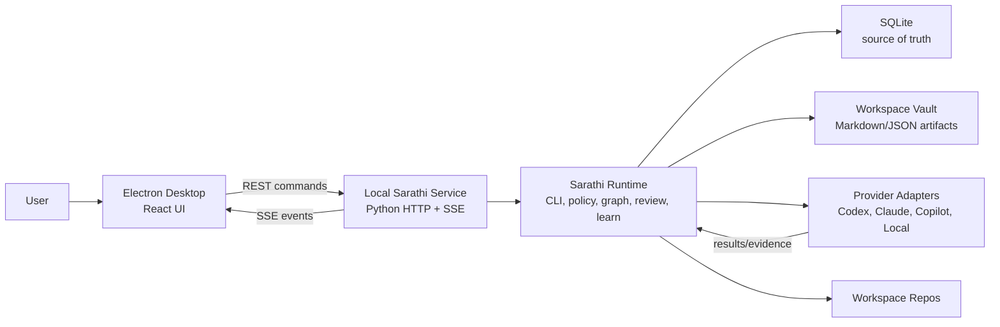
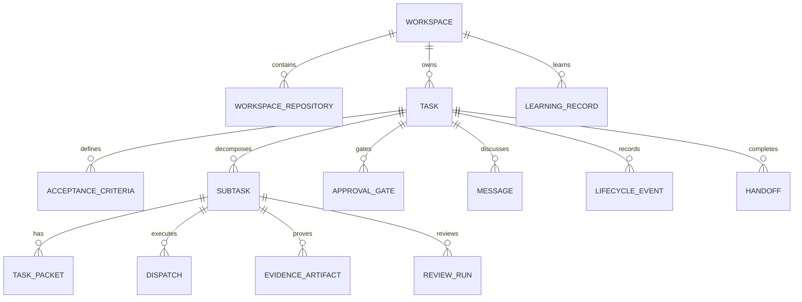
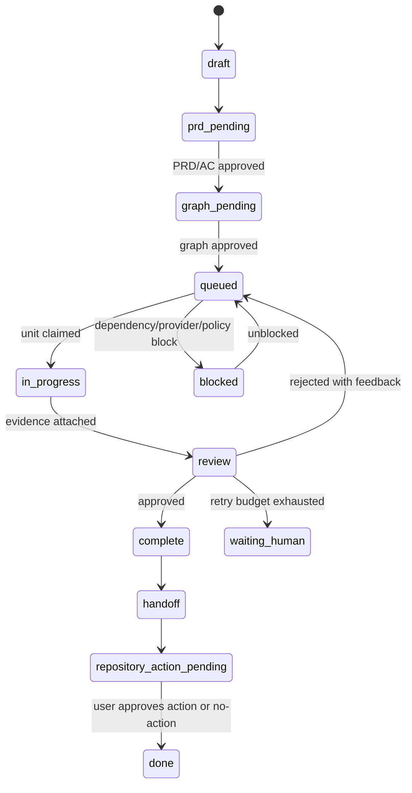

# Sarathi App Technical Design

Date: 2026-04-27
Owner: Sarathi dogfood workspace
Status: Draft for review

## 1. Executive Summary

Sarathi should become a 9/10 product by turning the existing 9/10 concept into a reliable local orchestration platform: a desktop cockpit backed by the Sarathi CLI/runtime, SQLite persistence, policy packs, Server-Sent Events, provider adapters, and a self-dogfooding evidence trail.

The core design principle is simple:

> The Python Sarathi runtime is the source of orchestration truth. The desktop app is the human cockpit. SQLite is the durable source of product state. SSE is a notification stream, not the database.

This avoids the common trap of building a pretty dashboard that reimplements workflow logic in the UI. Sarathi already has policy, graph, review, recovery, learning, and phase primitives. The app should expose and harden those primitives through a local service boundary.

## 2. Goals

- Reach product-quality parity between concept and implementation.
- Ship a local-first desktop app in the coming weeks.
- Prove "Sarathi builds Sarathi" by developing the app through Sarathi CLI/Skill artifacts.
- Make workspace the mandatory boundary for all tasks, repos, policies, providers, inbox items, events, diagrams, and learnings.
- Provide a Task Studio truth surface: graph, list, packet, messages, evidence, review, history, and handoff.
- Support role-first/provider-second orchestration across Codex, Claude, Copilot, and local deterministic providers.
- Make every completion evidence-backed and every repository action explicitly approved.
- Keep MVP technically narrow enough to finish, while leaving clear extension seams for V1.

## 3. Non-Goals For MVP

- Hosted multi-tenant control plane.
- Full team sharing or cloud sync.
- Full provider-cost analytics.
- Jira/Linear production sync.
- Advanced graph editing.
- Full security center.
- Full skills marketplace.
- Fully automatic multi-provider execution without manual/semi-auto escape hatches.

## 4. Architecture Overview

Recommended architecture:



Key decisions:

- Desktop shell: Electron with React and TypeScript.
- Local service: Python, packaged with the existing Sarathi CLI/runtime.
- Persistence: SQLite in app data directory by default, with workspace-local advanced option.
- Events: append lifecycle/event records to SQLite, then publish SSE notifications.
- Artifacts: Markdown/JSON exports in workspace vault for human and agent readability.
- Provider execution: adapter interface around CLI/process execution first, hosted adapters later.

## 5. Major Components

### 5.1 Electron Desktop

Responsibilities:

- Render workspace-scoped shell.
- Provide navigation: Workspace, Orchestrator, Inbox, Tasks, Views, Agents, Lifecycle, History, Diagrams, Usage, Settings.
- Host Task Studio.
- Open command palette.
- Show local service health and degraded mode.
- Never own orchestration state beyond local UI state/cache.

Suggested frontend component boundaries:

- `AppShell`
- `SidebarNav`
- `WorkspaceSwitcher`
- `TopCommand`
- `StatusStrip`
- `WorkspaceOverview`
- `OrchestratorChat`
- `Inbox`
- `TaskDashboard`
- `TaskStudio`
- `UnitGraph`
- `UnitList`
- `UnitPacketInspector`
- `ApprovalGates`
- `MessageThread`
- `EvidencePanel`
- `ReviewPanel`
- `HistoryPanel`
- `HandoffPanel`
- `AgentsDashboard`
- `LifecycleView`
- `Settings`

### 5.2 Local Sarathi Service

Responsibilities:

- Expose REST API and SSE stream to desktop.
- Wrap existing CLI/runtime modules.
- Manage SQLite migrations.
- Validate policy packs.
- Run repository intake.
- Create and mutate task graph state.
- Dispatch provider work.
- Enforce approval gates.
- Record events and artifacts.
- Update workspace vault and learnings.

This should be a thin application service layer over existing modules, not a second orchestration engine.

Recommended implementation:

- Python `http.server`/ASGI-compatible minimal service for MVP.
- If adding dependency is acceptable, use FastAPI plus Uvicorn for clear schemas and streaming.
- If avoiding dependencies is more important, use Python stdlib plus explicit JSON routing first.

Staff recommendation: use FastAPI only if packaging remains clean. The ergonomics and OpenAPI contract are worth it for a desktop-local service.

### 5.3 Sarathi Runtime

Existing modules should remain authoritative:

- `src/engine.py`: lifecycle phase progression.
- `src/policy/*`: compile and validate policy packs.
- `src/runtime/graph_policy.py`: graph execution controls.
- `src/runtime/graph_executor.py`: graph step execution.
- `src/runtime/review.py`: structured review behavior.
- `src/runtime/recovery.py`: resume/recovery semantics.
- `src/runtime/learning.py`: learn/evolve records.
- `src/runtime/artifacts.py`: artifacts and evidence.
- `src/task_graph.py`: graph scheduling and state.

New runtime seams needed:

- `src/service/`: local API application.
- `src/storage/`: SQLite repositories and migrations.
- `src/events/`: durable events plus SSE broadcaster.
- `src/workspace/`: workspace and repo intake.
- `src/providers/`: provider adapter contracts.
- `src/dogfood/`: "Sarathi builds Sarathi" fixture and export helpers.

## 6. Data Model

SQLite is source of truth. Workspace vault files are portable projections. SSE is notification only.

MVP tables:

```text
workspaces
workspace_repositories
workspace_files
policy_packs
providers
provider_health_checks
tasks
acceptance_criteria
subtasks
task_dependencies
task_packets
approval_gates
dispatches
messages
evidence_artifacts
review_runs
review_findings
lifecycle_events
handoffs
learning_records
saved_views
inbox_items
diagram_artifacts
settings
```

Core relationships:



### 6.1 Entity Design Notes

`approval_gates` must be first-class, not hardcoded UI state. Each gate has:

- `id`
- `workspace_id`
- `task_id`
- `gate_type`
- `status`
- `required_by_policy`
- `requested_by`
- `approved_by`
- `approved_at`
- `evidence_refs`
- `event_id`

`evidence_artifacts` must link across the graph:

- `workspace_id`
- `task_id`
- `subtask_id`
- `acceptance_criteria_id`
- `approval_gate_id`
- `review_run_id`
- `artifact_type`
- `source`
- `uri`
- `summary`
- `status`

`review_runs` should use one schema for all review types:

- `type`: self, code, QA, security, functional, regression, release.
- `verdict`: approved, rejected, blocked, needs_human.
- `loop_index`
- `max_loops`
- `findings`
- `evidence_refs`
- `next_action`

## 7. API Design

MVP local API should be boring, predictable, and easy to test.

### 7.1 Workspace APIs

```text
GET    /api/workspaces
POST   /api/workspaces
GET    /api/workspaces/{workspace_id}
PATCH  /api/workspaces/{workspace_id}
POST   /api/workspaces/{workspace_id}/repos
POST   /api/workspaces/{workspace_id}/intake
GET    /api/workspaces/{workspace_id}/vault
```

Repository intake flow:

1. Inspect repo.
2. Detect existing Sarathi artifacts.
3. Generate or propose wiki/policy/coding standards/guidelines.
4. Record generated artifacts as draft evidence.
5. Ask for approval before overwriting or mutating files.

### 7.2 Task APIs

```text
GET    /api/workspaces/{workspace_id}/tasks
POST   /api/workspaces/{workspace_id}/tasks
GET    /api/tasks/{task_id}
PATCH  /api/tasks/{task_id}
POST   /api/tasks/{task_id}/prd
POST   /api/tasks/{task_id}/graph
POST   /api/tasks/{task_id}/approve
POST   /api/tasks/{task_id}/dispatch
POST   /api/tasks/{task_id}/resume
POST   /api/tasks/{task_id}/handoff
```

### 7.3 Subtask APIs

```text
GET    /api/tasks/{task_id}/subtasks
GET    /api/subtasks/{subtask_id}
PATCH  /api/subtasks/{subtask_id}
POST   /api/subtasks/{subtask_id}/claim
POST   /api/subtasks/{subtask_id}/dispatch
POST   /api/subtasks/{subtask_id}/evidence
POST   /api/subtasks/{subtask_id}/review
```

### 7.4 Provider APIs

```text
GET    /api/providers
POST   /api/providers
PATCH  /api/providers/{provider_id}
POST   /api/providers/{provider_id}/health-check
POST   /api/providers/{provider_id}/dispatch-test
```

### 7.5 Events API

```text
GET    /api/events?workspace_id=&task_id=&type=&severity=
GET    /api/events/stream
```

SSE events are compact invalidation signals:

```json
{
  "id": "evt_123",
  "type": "task.updated",
  "workspace_id": "ws_1",
  "task_id": "task_42",
  "object_id": "st_02",
  "severity": "info",
  "created_at": "2026-04-27T18:44:12Z"
}
```

The UI receives this, then refetches relevant data from REST.

## 8. Execution Model

### 8.1 Task Lifecycle



### 8.2 Approval Gates

MVP gates:

- PRD/AC gate.
- Task graph gate.
- Execution policy gate.
- Review override gate.
- Repository action gate.

Rules:

- Gates are persisted.
- Gates create history events.
- Gates link to evidence.
- Gates can be approved, rejected, skipped by policy, or marked waiting human.
- Repository action gate can never be skipped silently.

### 8.3 Graph Execution

Use existing `TaskGraphExecutor` and `GraphExecutionPolicy`.

MVP scheduler behavior:

- Select ready nodes.
- Respect dependencies.
- Respect policy step limits and retry budgets.
- Continue non-blocked siblings.
- Mark exhausted failed nodes as waiting human.
- Emit events after every state transition.
- Persist graph state after every node transition.

### 8.4 Provider Dispatch

Provider adapter interface:

```python
class ProviderAdapter:
    name: str
    capabilities: set[str]

    def health_check(self) -> ProviderHealth: ...
    def can_handle(self, packet: TaskPacket) -> bool: ...
    def dispatch(self, packet: TaskPacket, context: DispatchContext) -> DispatchResult: ...
```

MVP adapters:

- `LocalDeterministicAdapter`: planning, simulation, validation, diagrams.
- `CodexCliAdapter`: implementation and review through local Codex flow where available.
- `ClaudeCliAdapter`: health/config plus optional review/research dispatch.
- `CopilotAdapter`: health/config stub first; real integration later.

Dispatch results must include:

- `success`
- `summary`
- `evidence_refs`
- `changed_files`
- `commands_run`
- `stdout_ref`
- `stderr_ref`
- `provider_metadata`
- `retryable`

## 9. Workspace Vault Design

Each workspace gets a human-readable vault:

```text
.sarathi/
  workspace.json
  SARATHI.md
  wiki/
    overview.md
    architecture.md
    repo-map.md
  policy-pack/
    commands.md
    review.md
    task-tracking.md
    model-routing.md
    escalation.md
    conventions.md
    complexity.md
    skills.md
  standards/
    coding-standards.md
    guidelines.md
  tasks/
    TASK-042/
      prd.md
      acceptance-criteria.md
      graph.json
      packet-ST-01.md
      evidence/
      reviews/
      handoff.md
  diagrams/
  learnings.md
```

SQLite remains canonical. Vault files are projections and dogfood artifacts.

## 10. Dogfood Architecture: Sarathi Builds Sarathi

The Sarathi app repository must be a workspace named `Sarathi App`.

Dogfood data must include:

- Product requirement task.
- Technical design task.
- Implementation plan task.
- Per-milestone task graph.
- Subtask packets for UI, local service, SQLite, SSE, provider adapters, review loop, handoff.
- Evidence artifacts for code changes and verification.
- Review runs from Nirnaya/Samanvaya.
- Handoff dossier for each milestone.
- Approved learnings in `learnings.md`.

The app should include a demo-safe dogfood view:

- Redact private paths/secrets.
- Show real task graph shape.
- Show evidence summaries.
- Show review loops and accepted learnings.
- Show release dossier.

This becomes both product proof and regression fixture.

## 11. Security And Trust Model

Local-first does not mean casual.

MVP controls:

- Bind local service to `127.0.0.1`.
- Random per-run desktop/service token.
- No plaintext secrets in UI or SQLite.
- Provider credentials use provider-native auth or OS keychain later.
- Repository mutations require explicit approval.
- Shell commands flow through policy allowlist.
- Dirty worktree detection before execution and handoff.
- Artifact redaction for dogfood/demo exports.

V1 controls:

- OS keychain integration.
- Command approval allowlist UI.
- Provider trust profiles.
- Skill scanner for prompt injection and dangerous commands.
- Optional encrypted SQLite.

## 12. Error Handling And Recovery

Recovery principles:

- Persist before emitting.
- Every failure creates an actionable event.
- Failed providers are not silent; they become routing state.
- User can resume, reroute, wait, manually complete, or cancel.

MVP recovery cases:

- Local service unavailable: desktop shows restart/retry action.
- SSE disconnected: UI falls back to polling.
- Provider offline: affected tasks become retryable or waiting human.
- Dirty worktree: execution/handoff blocks until user acknowledges.
- Review retry budget exhausted: task enters waiting human.
- App restart: graph, messages, evidence, approvals, and reviews reload from SQLite.

## 13. Testing Strategy

### 13.1 Python Runtime Tests

- Policy compilation and validation.
- Graph policy parsing.
- Graph execution and retry budget.
- Approval gate transitions.
- SQLite repositories and migrations.
- Event persistence.
- Provider adapter contracts.
- Repository intake.
- Recovery/resume.

### 13.2 API Contract Tests

- Workspace CRUD and repo intake.
- Task creation and graph generation.
- Approval gate creation/approval/rejection.
- Dispatch path with local deterministic provider.
- Evidence attachment.
- Review rejection loop.
- Handoff generation.
- SSE stream emits after persisted events.

### 13.3 Desktop Tests

- Route smoke tests.
- Workspace setup wizard.
- New task chat to PRD/AC draft.
- Task dashboard filters.
- Task Studio graph/list toggle.
- Unit packet inspector.
- Evidence/review/handoff tabs.
- Settings provider health.
- SSE reconnect and polling fallback state.

### 13.4 Dogfood Acceptance Test

The Sarathi app dogfood workspace must prove:

- The app was built using Sarathi CLI/Skill.
- Each milestone has task graph and handoff artifacts.
- Evidence references are attached to completed units.
- Review loops are recorded.
- Learnings are approved and exported.
- Release dossier can be shown in the app.

## 14. Build Plan For Coming Weeks

### Week 1: Foundations

- Create `Sarathi App` dogfood workspace.
- Add SQLite storage layer and migrations.
- Add local service skeleton.
- Add Electron/React shell from v2 prototype.
- Add workspace CRUD and repo intake preview.

Exit: desktop opens, service runs, workspace persists, repo intake drafts artifacts.

### Week 2: Structured Tasks

- Add task, PRD/AC, subtask, dependency, task packet tables.
- Add task creation API.
- Add graph generation API.
- Add approval gates.
- Build Task Dashboard and Task Studio read paths.

Exit: chat creates task draft, graph/list visible, packet inspector works.

### Week 3: Execution And Events

- Wire `TaskGraphExecutor` to persisted graph.
- Add local deterministic provider.
- Add Codex CLI adapter health and dispatch prototype.
- Add dispatch/evidence/event APIs.
- Add SSE stream and polling fallback.

Exit: one unit can dispatch, persist evidence, update graph, and stream UI changes.

### Week 4: Review And Handoff

- Add review run schema and review loop.
- Add review panel and rejected-review requeue.
- Add handoff generator.
- Add repository action approval gate.
- Add dirty worktree safety.

Exit: task completes with evidence, review, handoff, and no repo action without approval.

### Week 5: Dogfood And Polish

- Run Sarathi app work through Sarathi itself.
- Add dogfood workspace/demo surface.
- Add learnings export.
- Add history filters and saved views.
- Add setup checklist and provider settings polish.

Exit: public-alpha demo can show "Built with Sarathi" dossier.

### Week 6: Hardening

- Reliability pass.
- Fixture tests.
- API contract tests.
- Desktop smoke tests.
- Packaging path.
- Documentation and release checklist.

Exit: MVP is ready for public-alpha review.

## 15. Key Technical Risks

| Risk | Why it matters | Mitigation |
| --- | --- | --- |
| UI reimplements orchestration | Creates divergent truth | Keep Python runtime authoritative |
| Scope explosion | 9/10 concept can swallow the product | Ship Task Studio core before analytics/marketplace |
| Provider execution brittleness | CLI tools vary by environment | Start with health checks, local adapter, and manual/semi-auto dispatch |
| SQLite schema churn | Early product model evolves quickly | Use explicit migrations and repository layer |
| SSE complexity | Streaming can hide persistence bugs | Persist first, emit second, refetch on event |
| Dogfood privacy | Demo could expose local paths/secrets | Redaction layer for exports and demo view |
| Review loops stall work | Too much governance slows delivery | Budgets, severity rules, human override |

## 16. Design Alternatives Considered

### Alternative A: Electron + Python Local Service

Pros:

- Reuses existing Sarathi runtime.
- Best local-first fit.
- Clear API boundary.
- Good dogfood story.

Cons:

- Packaging Python with Electron needs care.
- Two-process lifecycle must be managed.

Recommendation: choose this for MVP.

### Alternative B: Pure Web App With Node Backend

Pros:

- Single TypeScript stack.
- Faster UI/backend iteration for web engineers.

Cons:

- Reimplements Python runtime logic or wraps CLI awkwardly.
- Weakens CLI/Skill-first identity.

Recommendation: avoid for MVP.

### Alternative C: Tauri + Python Sidecar

Pros:

- Smaller native bundle.
- Strong desktop story.

Cons:

- More packaging and Rust/Tauri learning overhead.
- Current prototypes and app direction are already Electron-shaped.

Recommendation: revisit after MVP.

## 17. Definition Of 9/10 Product

Sarathi reaches 9/10 product quality when:

- A user can install, create workspace, attach repo, and start a task without reading source.
- Task Studio makes orchestration traceable at a glance.
- Every subtask has a packet, owner role, provider route, dependencies, evidence, and review state.
- Provider failures are recoverable and visible.
- Repository mutations are safe and approved.
- History can explain every major decision.
- The app survives restart without lost state.
- The product can show how Sarathi built Sarathi.
- The user trusts the handoff enough to approve commit/PR.

## 18. Open Technical Decisions

- FastAPI dependency versus stdlib local service.
- Electron packaging approach for bundled Python.
- SQLite location defaults and workspace-local override behavior.
- First real provider adapter depth for Codex.
- Whether desktop app should embed a terminal panel in MVP or defer to V1.
- Whether dogfood demo data is generated from real workspace artifacts or curated export snapshots.

## 19. Recommended Next Step

Freeze this technical design, then create an implementation plan that decomposes the app into parallelizable milestones:

- Storage/service foundation.
- Desktop shell.
- Workspace/repo intake.
- Task model and graph.
- Task Studio.
- Provider adapters.
- Review/handoff.
- Dogfood dossier.

Each milestone should be created as a Sarathi task inside the `Sarathi App` workspace so the build process itself generates the proof we want the product to show.
